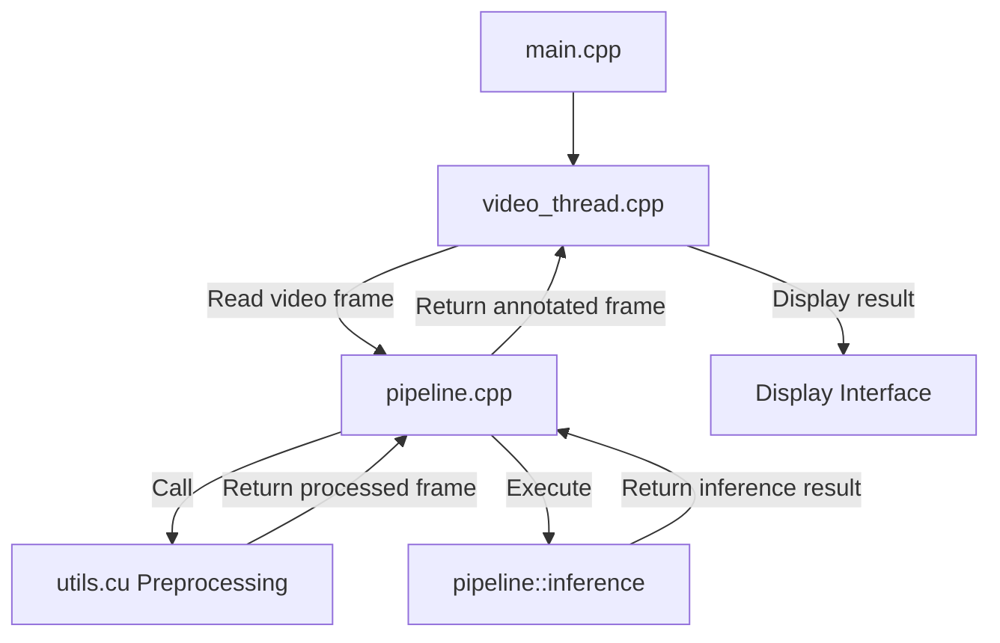

<div align="center">
  <h1>Real-time Industrial Defect Inference Detection (C++)</h1>
</div>

<div align="center">

[中文](./README_ch.md) | English

</div>

<div align="center">

Paper Address | [Python Project Address](https://github.com/ShowayLiao/LiMR)

</div>

<div align="center">

<h3>This project is implemented based on the LiMR model and includes the following content</h3>

</div>

* Installation of essential deep learning libraries for C++ (OpenCV, TensorRT, LibTorch, CUDA)
* CMakeList and VSCode configuration
* Implementation of dual-model TensorRT acceleration
* Three preprocessing methods (OpenCV, OpenCV DNN, OpenCV CUDA + kernel function optimization)
* FP16 optimization for acceleration
* Post-processing using LibTorch in C++
* Real-time video processing and inference

# 📌 Introduction
It is well-known that deploying deep learning models with C++ can be challenging, yet its acceleration capabilities make it the preferred choice for industrial deployment. Unlike common YOLO or MaskRCNN deployment projects, industrial defect detection models take images as both input and output, with edge scenarios requiring maximally compressed computation time. Therefore, the implementation of image preprocessing, model acceleration, and post-processing code in this project faces scarce reference materials. We hope this project provides valuable reference for similar implementations.

Additionally, configuring OpenCV, TensorRT, and other libraries through CMake in VSCode has limited public documentation. This tutorial aims to provide detailed configuration methods to improve development efficiency.

> After four optimizations, the end-to-end processing time per image is **<30ms**, with throughput **>30 imgs/s**, achieving real-time inference and doubling the inference speed. (Display computation time not included in table below)

| Optimization                  | Preprocessing Time (ms) | Inference Time (ms) | Post-processing Time (ms) | Total Time (ms) |
|-------------------------------|--------|------------|---------------|-----------|
| Initial C++ Implementation    | 11     | 17         | 5             | 33        |
| Preprocessing DNN Acceleration| 8      | 17         | 5             | 30        |
| Preprocessing CUDA Acceleration| 4      | 17         | 5             | 26        |
| Shallow Copy Optimization     | 4      | 17         | 3             | 24        |
| FP16 Inference Acceleration   | 4      | 8          | 3             | 15        |

<details style="color:rgb(128,128,128)">
<summary>Hardware/Software Configuration (Reference)</summary>

* CPU: Intel(R) Core(TM) i5-12500H CPU @ 2.50GHz
* RAM: 16 GB
* GPU: NVIDIA GeForce RTX 3050(4GB) Laptop
* Windows 11
* CUDA==11.6
* Other library versions detailed later  
*(~~Modest configuration should run smoothly on most laptops😂~~)*

</details>


# 📌 Quick Start
~~(May not be as quick as expected)~~

## Ⅰ Environment Configuration
Due to space limitations, only version numbers are listed here. For detailed installation, refer to [Installation Guide](./doc/install.md).

* CMake==3.15.7
* Visual Studio == 2019 (MSVC==v142)
* CUDA==11.6
* OpenCV\==4.5.5 (contrib\==4.5.5)
* TensorRT==10.12.0.36
* LibTorch==1.13.0
  
## Ⅱ Modify CMakeLists
Adjust paths in the following code to your actual installation paths. For CMake customization, see [CMake Configuration Guide](./doc/cmake_en.md).
<div align="center">

```cpp
cmake

set(OpenCV_DIR "C:/opencv_s/build/install") // Actual install path

set(TRT_DIR "C:/tensorRT/TensorRT-10.12.0.36.Windows.win10.cuda-11.8/TensorRT-10.12.0.36") // Root directory

set(Torch_DIR "~/libtorch/share/cmake/Torch") // Corresponding path

find_package(Torch REQUIRED)

include_directories(~/libtorch/include/torch/csrc/api/include)

include_directories(~/libtorch/include)

link_directories(~/libtorch/lib)

```

</div>

## Ⅲ Compile with CMake
1. Search for CMake in VSCode extensions, install `CMake` and `CMake Tools`
2. Restart VSCode, press `ctrl+shift+p`, type `cmake`, select `vs2019 amd64` compiler
3. Open `CMakeLists.txt`, press `ctrl+s` to auto-compile, or press `ctrl+shift+p`, type `cmake`, and select `configure`

<details style="color:rgb(128,128,128)">
<summary> Debug Configuration </summary>

```json

{

"version": "0.2.0",

    "configurations": [

        {

            "name": "(gdb) Launch",

            "type": "cppdbg",

            "request": "launch",

            "program": "${workspaceFolder}/build/Debug/main", // Default CMake output path

            "args": [], // Command line arguments

            "stopAtEntry": false,

            "cwd": "${workspaceFolder}",

            "environment": [],

            "externalConsole": false,

            "MIMode": "gdb",

            "setupCommands": [ // GDB optimization

            { "text": "-enable-pretty-printing", "ignoreFailures": true }

            ]           

        }

    ]

}

```

</details>

## Ⅳ Run the Program
* Export engine/onnx files from the [Python project](https://github.com/ShowayLiao/LiMR/tree/onnx) and place in `/input`. Without engine files, they will be auto-generated from onnx during runtime.
* Place inference video/image files in `/input`
* Modify filenames in [main.cpp](./src/main.cpp)
* Run the program (empty img path triggers video inference; specified path triggers image inference)

# 📌 Technical Details
## Ⅰ Workflow and Data Pipeline
<div align="center">



</div>

## Ⅱ Technical Highlights

### GPU-accelerated Image Preprocessing:
* Utilizes `cv::cuda` with kernel-optimized HWC→CHW conversion
* Preprocessing time reduced to **36.4%** of CPU-based methods

### Shallow Copy Optimization
* Activated via CMake flag `USE_DIRECT_BLOB=ON`
* Reduces post-processing time by **20%** via avoiding data transfers
* Essential for handling multi-output tensor models

### FP16 Acceleration
* Enabled during engine export (FP32 input/output maintained for compatibility)
* Halves model memory footprint and inference time (**47.1%** of FP32)
* Critical for edge devices with limited VRAM (e.g., 4GB GPUs)

### Real-time Performance
* **<30ms** end-to-end latency per image (display excluded)
* Sustained throughput **>30 FPS** meets industrial real-time 

# 📌 TODO
* Multi-threaded pipeline for parallel preprocessing/inference/post-processing
* Simplified GUI interface
* ......

# 📌 Acknowledgements
> If you find this project helpful, please give a ⭐ on GitHub  
> Suggestions and PRs are welcome in Issues  
> Your support fuels continuous improvement!

# License
This repository is licensed under the [Apache-2.0 License](LICENSE).
