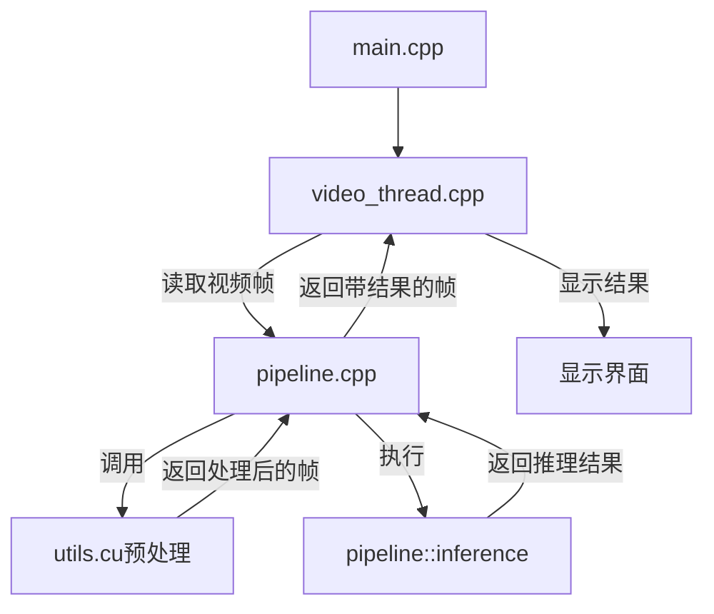

<div align="center">
  <h1>工业缺陷实时推理检测（c++）</h1>
</div>

<div align="center">

中文 | [English](./README.md)

</div>

<div align="center">

论文地址 | [python项目地址](https://github.com/ShowayLiao/LiMR)

</div>

<div align="center">

<h3>本项目基于LiMR模型实现，包含以下内容</h3>

</div>

* 主流深度学习c++必需库（OpenCV、TensorRT、LibTorch、cuda）的安装
* CMakeList、VScode配置
* 实现双模型tensorRT加速
* 预处理的三种实现方式（OpenCV、OpenCVdnn、OpenCVcuda+核函数优化）
* 半精度优化加速
* 在c++利用LibTorch进行后处理
* 实时视频处理和推理

# 📌 前言
久闻c++对于深度学习模型的部署之难，但是其加速之快依然为工业部署的首选。与常见的YOLO、MaskRCNN部署项目不同的是，工业缺陷检测模型的输入和输出都是图片，且边缘场景要求尽可能压缩运算时间，因此本项目图片预处理、模型加速、图片后处理的相关代码的撰写都存在着参考资料稀少的问题，希望借此为后来者搭建类似项目提供一定的参考。

同时，在vscode上利用CMake实现对OpenCV、TensorRT等库的管理，能参考的公开资料有限，因此走了不少弯路。因此，本教程会尽可能详尽地说明相关库的配置方法，提高开发效率。

> 经过四次优化，本项目单次端到端时间<30ms，吞吐量>30imgs/s，实现了实时推理，推理速度翻倍。（如下表格没有计算显示图片的计算时间）

| 优化                  | 预处理时长（ms）   | 推理时长（ms）   |   后处理时长（ms）  |   总时长（ms）    |
|---------------------------|--------|------------|---------------|-----------|
|   原始c++      | 11 | 17 | 5 | 33 |
| 预处理dnn加速  | 8 | 17 | 5| 30|
| 预处理cuda加速 | 4 | 17 | 5| 26|
| 后处理浅拷贝优化 | 4 | 17 | 3 | 24 |
| 推理FP16加速 | 4 | 8 | 3 | 15 |

<details style="color:rgb(128,128,128)">
<summary>分享本人的软硬件配置（仅供参考）</summary>

* CPU: Intel(R) Core(TM) i5-12500H CPU @ 2.50GHz
* RAM: 16 GB
* GPU: NVIDIA GeForce RTX 3050(4GB) Laptop
* Windows 11
* CUDA==11.6
* 其他库的详细版本后文会提及
（~~配置已经很低了，应该都能跑得动，毕竟我是笔记本电脑😂~~）

</details>


# 📌 快速开始
~~（其实不会很快）~~

## Ⅰ 配置相关环境
篇幅所限，此处仅给出本项目依赖的版本号，具体安装方法参考[安装方法](./doc/安装方法.md)。

* CMake==3.15.7
* Visual Studio == 2019（MSVC==v142）
* CUDA==11.6
* OpenCV\==4.5.5（contrib\==4.5.5）
* TensorRT==10.12.0.36
* LibTorch==1.13.0
  
## Ⅱ 调整CMakeLists内容
调整下面代码中的路径为实际安装的路径。若想调整cmake相关内容以适应需求，可参考[cmake配置方法](./doc/cmake.md)。


```cpp
set(OpenCV_DIR "C:/opencv_s/build/install")// 实际install路径
set(TRT_DIR "C:/tensorRT/TensorRT-10.12.0.36.Windows.win10.cuda-11.8/TensorRT-10.12.0.36")// 根目录
set(Torch_DIR "~/libtorch/share/cmake/Torch")// 对应
find_package(Torch REQUIRED)
include_directories(~/libtorch/include/torch/csrc/api/include)
include_directories(~/libtorch/include)
link_directories(~/libtorch/lib)

```


## Ⅲ 使用CMake编译
1. 在扩展插件里搜索CMake，下载`CMake`和`CMake Tools`
2. 完成后，重启VSCode，`ctrl+shift+p`，输入`cmake`，找到选择工具包，`vs2019 amd64`版本的编译器。
3. 打开`CMakeLists`，`ctrl+s`保存就会自动编译，或者`ctrl+shift+p`并输入`cmake`，找到`configure`也可以实现编译

<details style="color:rgb(128,128,128)">
<summary> 调试程序 </summary>

```json
{
    "version": "0.2.0",
    "configurations": [
      {
        "name": "(gdb) 启动",
        "type": "cppdbg",
        "request": "launch",
        "program": "${workspaceFolder}/build/Debug/main",  // cmake的默认生成路径
        // Linux/macOS 可能为 "${workspaceFolder}/build/my_app"
        "args": [],  // 命令行参数
        "stopAtEntry": false,
        "cwd": "${workspaceFolder}",
        "environment": [],
        "externalConsole": false,
        "MIMode": "gdb",
        "setupCommands": [  // GDB 优化设置
          { "text": "-enable-pretty-printing", "ignoreFailures": true }
        ],
        // "miDebuggerPath": "/usr/bin/gdb"  // Linux/macOS 需指定 GDB 路径
      }
    ]
  }

```

</details>

## Ⅳ 启动程序
* 首先，需要将从[python项目](https://github.com/ShowayLiao/LiMR/tree/onnx)中导出的engine或onnx文件放在input文件夹下。如果没有engine文件，运行时会根据onnx文件自动生成engine文件并进行推理。
* 同时，推理需要的视频文件，或者图片文件，也需要放在input文件夹下。
* 然后，在[main](./src/main.cpp)程序中，修改文件开头中的文件名。
* 点击运行，即实现推理。（img路径为空，则执行视频推理，反之执行单图片推理）


# 📌 相关细节
## Ⅰ 程序作用与与数据流向
<div align = "center">



</div>

## Ⅱ 技术细节

### 显卡优化的高速图片预处理：
* 预处理使用`cv::cuda`库进行加速，但是格式依然为HWC，需要转换为CHW才能被推理引擎所处理
* 为了实现高速推理，撰写了[核函数](./src/utils.cu)对`HWC->CHW`这一过程进行了高效实现
* 优化后预处理时间仅为使用cpu库的**36.4%**
### 后处理的浅拷贝优化
* CMakeLists的全局变量`USE_DIRECT_BLOB`为`on`时，开启浅拷贝优化，即只获取变量名，不转移数据。
* 由于后处理要循环处理三个输出的张量，因此该优化带来的效率提升依然客观，后处理时间降低**20%**

### FP16加速优化
* 在python项目中导出engine文件时，默认开启FP16优化。该设置启动后，中间层的参数存储为FP16类型，权重文件和显存占用降低为原来FP32的**50%**
* 同时，输入和输出节点依然为FP32，因此**兼容旧有的FP32开发程序**。（实际上，本项目同时已经实现了FP16的输入输出优化，调整type即可）
* 优化后，时间降低为原来FP32的**47.1%**

### 实时推理
* 考虑到未计算显示所消耗的计算时间，因此单张图片的输出时间 **<30ms**，输出帧率稳定在**30FPS**以上，满足工业场景实时检测的需求。


# 📌 TODO
* 多线程并行，实现预处理、推理、后处理并行，进一步降低总体时间
* 简单的可视化界面
.......


# 📌 Acknowledge
> 如果您觉得本项目对您有所帮助，可以在 GitHub 上加一个⭐<br/>
> 水平有限难免存在未知的纰漏，欢迎所有人在Issues交流指正或提交PR改进项目<br/>
> 您的支持就是持续改进项目的动力，谢谢！


# License

This repository is licensed under the [Apache-2.0 License](LICENSE).


