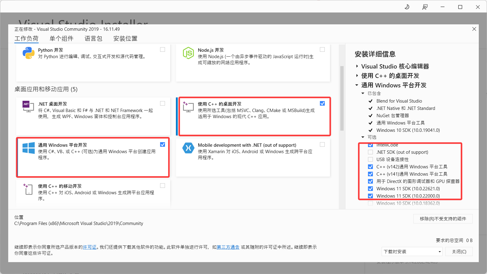
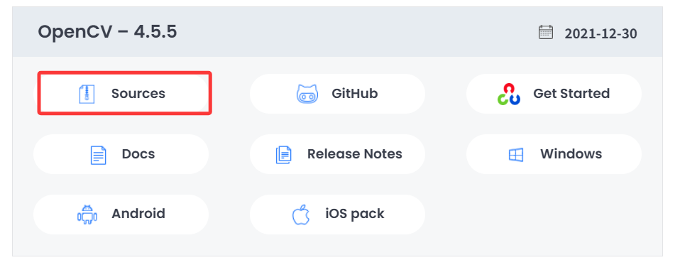

<div align="center">

<h1> Environment Installation Guide </h1>

</div>


# 📌 Install CMake
<details style="color:rgb(128,128,128)">
<summary>Important Notes</summary>

* Installing CMake serves two main purposes: compiling OpenCV and building your own projects.
* While project compilation has no strict version requirements, compiling OpenCV does. Using incompatible versions may cause errors.
* The version number provided here is a reference based on project compatibility.

</details>

## 1. Version Selection

```
cmake version 3.15.7
```

## 2. Official Download and Installation
[Download Link](https://cmake.org/files/v3.15/). Select version `cmake-3.15.7-win64-x64.msi`. After downloading, run the installer and **note the installation path**.

<details style="color:rgb(128,128,128)">
<summary>Notes</summary>

* Other versions on the same page are also acceptable.

</details>


# 📌 Install CUDA
<details style="color:rgb(128,128,128)">
<summary>Important Notes</summary>

* While CUDA is likely already installed, note that installing CUDA *before* Visual Studio may cause compilation failures in VS Code.
* CUDA libraries for Windows C++ programs require `cl.exe` (the Visual Studio compiler). The VS compiler version must match CUDA's requirements.
* CUDA 11.6 requires VS2019, whose official standalone installer is no longer available.
* Installing CUDA after VS may cause unrecognized library errors.

</details>

### 1. Install Visual Studio 2019
Download via [link](https://aka.ms/vs/16/release/vs_community.exe). During installation, select components as shown below:
<div align="center">



</div>

### 2. Install CUDA & cuDNN
* Follow standard tutorials. During CUDA installation, choose **Custom Installation** and **select all available options** (except pre-installed drivers).
* After installation, verify that `~\bin` and `~\lib` paths are added to system environment variables.

<details style="color:rgb(128,128,128)">
<summary>Notes</summary>

* Selecting all options ensures necessary compute libraries are included.
* `bin` contains precompiled binaries – missing PATH entries cause runtime errors (e.g., "missing xx file").
* `lib` contains dynamic libraries – missing PATH entries cause linking errors during execution.
* OpenCV and TensorRT have similar dependencies.

</details>


# 📌 Install OpenCV

<details style="color:rgb(128,128,128)">
<summary>Important Notes</summary>

* OpenCV offers precompiled binaries or self-compiled versions. Precompiled versions (e.g., `opencv_world`) are simpler but **lack CUDA acceleration**.
* This guide focuses on compiling OpenCV with CUDA support.
* Successful compilation requires **zero errors**; otherwise, the `install` step will fail.

</details>

## 1. Download OpenCV Source
1. Download from [official site](https://opencv.org/releases/page/2/). Select version **4.5.5** and choose `Sources`.
<div align="center">



</div>

## 2. Compile OpenCV with CMake

### a. Initial Configuration
* Launch `C:\Program Files\CMake\bin\cmake-gui.exe`.
* Configure as shown below:  
  1. Source code path (OpenCV folder).  
  2. Build directory (new empty folder).  
  3. Specify generator: **Visual Studio 2019**.  
* Click `Configure` → `Generate`.
<div align="center">


</div>

### b. Second-Round Configuration
<details style="color:rgb(128,128,128)">
<summary>Why Reconfigure?</summary>

* Initial configuration often fails due to missing dependencies.  
* CUDA acceleration requires the `opencv_contrib` module.  

</details>

#### Fix Common Errors
1. **Python mismatch**: Disable Python-related options by searching `PYTHON` in CMake and unchecking all entries.  
2. **Download failures**: Manually download missing 3rd-party libraries:  
   - Visit [OpenCV 3rdparty](https://github.com/opencv/opencv_3rdparty/).  
   - Locate the cache folder (e.g., `C:\opencv_s\opencv-4.5.5\.cache\ffmpeg`).  
   - Download the required branch (e.g., `ffmpeg/src`), rename files to match cache hashes, and replace them.  

#### Add Essential Modules
1. Search `CUDA` and enable all CUDA-related options.  
2. Download [opencv_contrib 4.5.5](https://github.com/opencv/opencv_contrib/releases/tag/4.5.5).  
3. Set `OPENCV_EXTRA_MODULES_PATH` to the extracted `opencv_contrib/modules` path.  
4. Disable unused modules (e.g., `wechat_qrcode`, `xfeatures2d`) if they cause errors.  

#### Final Configuration
1. Re-run `Configure` → `Generate`. Resolve any remaining errors.  
2. Ensure no red entries appear before proceeding.  

## 3. Generate Install Files with Visual Studio 2019
1. Click `Open Project` in CMake to launch VS2019.  
2. Navigate to **Build → Batch Build**. Check `INSTALL` under `Debug` or `Release`.  
3. Compilation takes ~4 hours.  
4. If minor errors occur, manually deselect problematic modules. After successful build:  
   - Add `~\install\x64\vc16\bin` and `~\install\x64\vc16\lib` to system PATH.  
<div align="center">


</div>


# 📌 Install TensorRT
Download version `TensorRT-10.12.0.36` from the [official site](https://developer.nvidia.com/tensorrt/download/10x). Extract the package, then add `~\TensorRT-10.12.0.36\bin` and `~\TensorRT-10.12.0.36\lib` to system PATH.

# 📌 Install LibTorch
1. Download **libtorch-win-shared-with-deps-1.13.0+cu116.zip** from [this link](https://download.pytorch.org/libtorch/cu116).  
2. Extract the package, then add `bin` and `lib` folders to system PATH.  

<div align="center">

<h3> All dependencies are now configured. </h3>

</div>