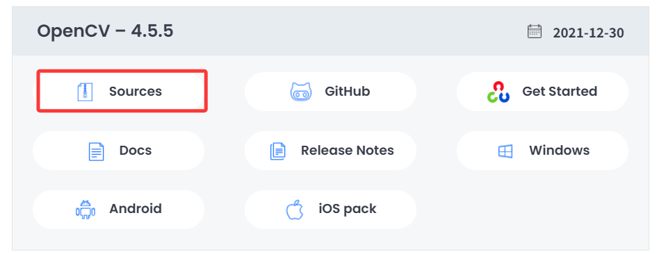
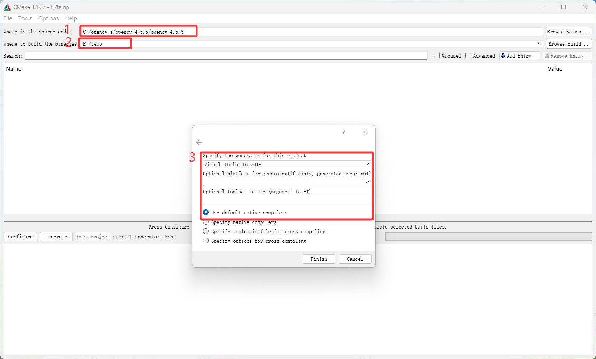
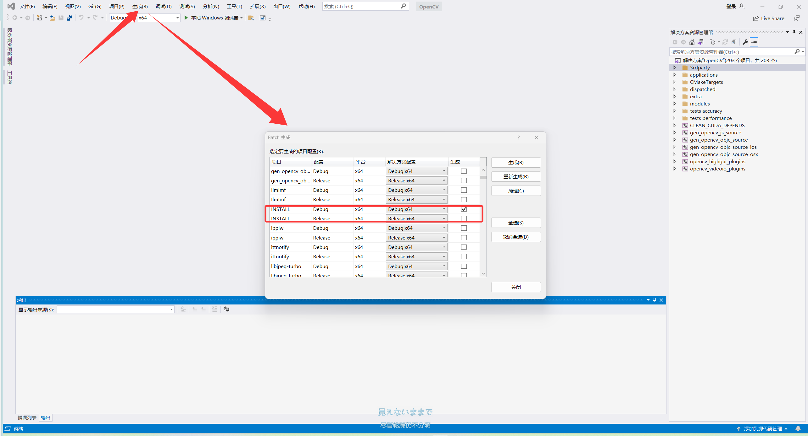

<div align="center">

<h1> 环境安装方法 </h1>

</div>


# 📌 安装cmake
<details style="color:rgb(128,128,128)">
<summary>建议看一看的碎碎念</summary>

* 安装cmake主要有两个目的，一个是编译运行opencv，一个是编译自己的项目。
* 编译自己的项目对版本号没有什么要求，但是编译opencv对cmake版本有一定要求，否则会报错
* 因此版本号的选择主要取决于opencv，本项目提供的版本号选择仅供参考

</details>

## 1. 版本号选择
```
cmake version 3.15.7
```

## 2. 官网下载并安装
[下载网址](https://cmake.org/files/v3.15/)，选择版本`cmake-3.15.7-win64-x64.msi`，下载完直接安装就好了，记住**安装的位置**

<details style="color:rgb(128,128,128)">
<summary>碎碎念</summary>

* 选择该页面下的其他版本其实也可以

</details>


# 📌 安装Cuda
<details style="color:rgb(128,128,128)">
<summary>建议看一看的碎碎念</summary>

* cuda我相信点进来的都应该安装了，但是这里还是必须提及，原因在于，安装cuda时不一定安装了vs，因此大概率导致在vscode中编译失败（这是为什么呢？）
* cuda库在windows平台c++程序上的编译，需要cl.exe，而这是visual studio自带的编译器，因此我们必须让vs的编译器版本与cuda库一一对应，才能在vscode上编译成功（~~就是这么绕~~）
* 同时，cuda会自带一个vs的编译器库，因此如果先安装cuda，后安装vs也会导致未识别等神秘错误编译失败
* 而大家一般苦于深度学习项目不支持太新的cuda库（比如我为11.6），但是11.6支持的vs编译器版本为2019，好巧不巧，微软官方关闭了官方下载入口😭
* 因此下文会从vs2019的下载和安装开始

</details>

### 1. Visual Studio 2019 安装
点击下载[链接](https://aka.ms/vs/16/release/vs_community.exe)，安装时选择与下图一致
<div align="center">


</div>

### 2. 安装cuda与cudnn
* 与网上多数教程是一致的，随便找一个照着做就可以。⚠️注意，安装cuda时选自定义，然后**勾选所有可选项**（除了已安装的驱动不勾选）
* 安装完之后，确认`~\bin`和`~\lib`路径是不是自动加入了环境变量

<details style="color:rgb(128,128,128)">
<summary>建议看一看的碎碎念</summary>

* 勾选所有文件，是因为需要包含必要的计算库，防止编译失败
* bin是cuda已经编译好的二进制文件，便于c++程序直接调用执行，不加入环境变量会导致可编译但执行报错（提示为缺少xx文件）
* lib是cuda的动态库文件，include之后，通常需要lib实例化，不加入环境变量会导致可编译但执行报错
* 后文的opencv与tensorRT都是类似的

</details>

# 📌 安装OpenCV

<details style="color:rgb(128,128,128)">
<summary>建议看一看的碎碎念</summary>

* opencv可以采用免编译版本和编译版本，二者区别在于一个使用`opencvworld`，一个使用分散的动态库文件
* 如果想省事确实可以使用前者，但是前者无法使用cuda库进行加速，只能使用较慢版本的加速方法
* 因此，后文主要介绍编译版本的安装方法
* 此外，安装opencv成功的核心在于编译过程中绝对不能有报错，否则会导致后续的`install`失败，后文主要围绕这一点进行详细阐释

</details>

## 1. 下载OpenCV未编译包
1. 下载[地址](https://opencv.org/releases/page/2/)，版本选择4.5.5，选择`sources`下载

<div align="center">



</div>

## 2. 使用cmake编译opencv

### a. 初次编译

* 找到cmake的安装路径，找到这个路径的文件`C:\Program Files\CMake\bin\cmake-gui.exe`，双击打开，用cmake对opencv进行编译
* 点击configure，按照下图进行编译选项的配置，1位置是源码的文件夹，2位置是新建的文件夹，用于存放编译后的文件，3是指定编译器，这里选择vs2019，选择默认即可。然后确认后，再次点击configure就会开始编译。

<div align="center">



</div>

### b. 二次编译
<details style="color:rgb(128,128,128)">
<summary>二次编译的原因</summary>

* 第一次编译会遇到非常多的报错，这些报错如果不解决，是无法生成正确的安装文件的
* 第一次编译，我们没有引入额外包`opencv_contrib`，因此无法使用cuda加速，需要在第二次编译引入

</details>

#### 处理报错
这里只整理常见错误类型
1. python版本不匹配报错：实际上我们不需要编译python版本，在第一次编译完的界面的search处输入python，将相关包勾选取消就可以了
2. 下载失败报错：这里最可靠的是手动前往opencv的[三方库](https://github.com/opencv/opencv_3rdparty/)，手动下载失败的包，替换下载缓存。以ffmpeg为例：
   * 首先找到对应的缓存路径，这里以`C:\opencv_s\opencv-4.5.5\opencv-4.5.5\.cache\ffmpeg`为例，下面会有一系列前面带有复杂数字+字母的哈希值和后面真正的文件名，我们的工作就是下载，然后重命名成一样的文件并替换。
   * 进入三方库，点击branch，找到对应的ffmpeg分支库（选src），下载zip文件，解压后，在文件路径`./ffmpeg`中找到对应的文件，然后按照对应的名字重命名成对应的文件，替换即可
   * 其他所有三方库都可以这样操作

#### 选择包
1. 在搜索栏处输入cuda，把相关包勾选。
2. [下载](https://github.com/opencv/opencv_contrib/releases/tag/4.5.5)额外编译包，注意这里的版本要与opencv一一对应
3. 在搜索栏处输入extra，在`OPENCV_ETRA_MODULES_PATH`处，填入解压好的额外编译包路径
4. 其余的包，本项目目前是不需要添加的

#### 再编译
1. 这时候再进行一次编译（configure），此时编译依然可能会报错（wechatcode），我们搜索并取消勾选即可。
2. 同时，根据后面编译的报错，我们仍然要取消勾选依赖于这个包的库`xfeatures2d`（~~应该是，这取决于后面生成报错的程序~~）
3. 完成取消后，再次点击configure进行编译，然后确认无报错后，点击generate

## 3. 使用Visual Studio 2019 生成install可执行程序
1. 完成上面的项目后，点击open project，会自动打开Visual Studio 2019
2. 按照图示打开批生成，仅勾选install栏，根据需求勾选release还是debug，这里勾选debug
3. 会有点久，需要预留一定的时间（约4h）
4. 如果出现报错xx无法生成（少量文件），可以在编译中手动取消这个包的编译。生成完成后，我们会在之前的编译文件夹路径下找到install文件夹，将里面的`~\install\x64\vc16\bin`和`~\install\x64\vc16\lib`加入环境变量。

<div align="center">



</div>


# 📌 安装TensorRT
去[官网](https://developer.nvidia.com/tensorrt/download/10x)下载对应的压缩包，这里我们使用的版本是`TensorRT-10.12.0.36`。下载完了之后，解压到任意位置，将`~\TensorRT-10.12.0.36\bin`和`~\TensorRT-10.12.0.36\lib`加入环境变量即可。

# 📌 安装LibTorch
1. 点击[链接](https://download.pytorch.org/libtorch/cu116)进入libtorch的下载页面，选择`libtorch-win-shared-with-deps-1.13.0%2Bcu116.zip`下载，其他cuda版本修改对应的cuxxx即可。
2. 下载好后解压，然后将对应的`bin`和`lib`加入环境变量即可。


<div align="center">

<h3> 至此，全部依赖库已配置完成

</div>


